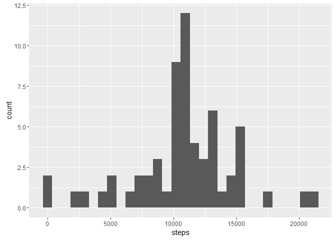

# Project1
Frank Hereygers  
3. April 2016  


# represearchproject1
This repository includes my project work for the coursera course reproducible research

## Loading required libraries and the data


```r
library(ggplot2)
```

```
## Warning: package 'ggplot2' was built under R version 3.2.4
```

```r
activity_data <- read.csv("C:/Data/activity.csv", header=TRUE)
```

## What is mean total number of steps taken per day?

1. First I calculate the total number of steps taken per day:


```r
stepsperday <- aggregate(steps ~ date, data=activity_data, sum)
```

2. Here is the Histogram of the total steps taken each day:


```r
p <- ggplot(stepsperday, aes(x = steps))
p <- p + geom_histogram()
p
```

```
## `stat_bin()` using `bins = 30`. Pick better value with `binwidth`.
```


3. Following figures are the mean and median of the total number of steps taken each day

```r
mean(stepsperday$steps)
```

```
## [1] 10766.19
```

```r
median(stepsperday$steps)
```

```
## [1] 10765
```

## What is the average daily activity pattern

1. Time series plot of the 5 minute interval and the average number of steps taken per interval over all days

```r
activity_pattern <- aggregate(steps ~ interval, data=activity_data, mean)
plot(activity_pattern$interval, activity_pattern$steps,type="l", main="Average Dialy Activity Pattern", xlab="Interval", ylab="average steps across all days")
```


2. Which Internal, contains the maximum number of steps on average.

```r
activity_pattern[which.max(activity_pattern[,2]),1]
```

```
## [1] 835
```

## Imputing missing values

1. Calculation of total number of missing values in the dataset

```r
sum(is.na(activity_data$steps))
```

```
## [1] 2304
```

2. Definition of Strategy for filling in all the missing values in the dataset

I have opted to replace the missing values with the average value of the respective interval.

3. Creation of new dataset with NAs replaced


```r
# add the average steps for each interval
new_activity_data <- merge(activity_data, activity_pattern, by.x="interval" , by.y="interval")
# replace all steps that have NA with average steps for this interval
new_activity_data$steps <- ifelse(is.na(new_activity_data$steps.x),new_activity_data$steps.y,new_activity_data$steps.x)
```

4. Histogram of the total number of steps taken each day


```r
# creating histogram for total number of steps taken each day
stepsperday <- aggregate(steps ~ date, data=new_activity_data, sum)
p <- ggplot(stepsperday, aes(x = steps))
p <- p + geom_histogram()
p
```

```
## `stat_bin()` using `bins = 30`. Pick better value with `binwidth`.
```



```r
# Calculate mean and median
mean(stepsperday$steps)
```

```
## [1] 10766.19
```

```r
median(stepsperday$steps)
```

```
## [1] 10766.19
```

The mean value does not differ from the Estimates from the first part of the asignment. The median however has changed and is now equal to the mean. I do not see any impact on the estimates of the total daily number of steps in the histogram.

## Are there differences in activity patterns between weekdays and weekends?

1. Creation of new factor value with two levels "weekday" and "weekend"


```r
activity_data$weekday <- weekdays(as.Date(activity_data$date),abbreviate =TRUE)
# Please note that due to my german settings I have to use "Sa" for "Sat" and "So" for "Sun"
activity_data$daytype <- factor(ifelse( activity_data$weekday=="Sa" | activity_data$weekday=="So" , "weekend" , "weekday" ))
```

2. Panel Plot


```r
activity_in_week <- activity_data[activity_data$daytype=="weekday",]
activity_in_weekend <- activity_data[activity_data$daytype=="weekend",]
activity_pattern_week <- aggregate(steps ~ interval, data=activity_in_week, mean)
activity_pattern_weekend <- aggregate(steps ~ interval, data=activity_in_weekend, mean)
par(mfrow=c(2,1))
plot(activity_pattern_week$interval, activity_pattern_week$steps,type="l", main="Average Dialy Activity Pattern on Weekdays", xlab="Interval", ylab="average steps across all days")
plot(activity_pattern_weekend$interval, activity_pattern_weekend$steps,type="l", main="Average Dialy Activity Pattern on Weekends", xlab="Interval", ylab="average steps across all days")
```


We see a clear difference in activity patterns between weekdays and the weekend.
